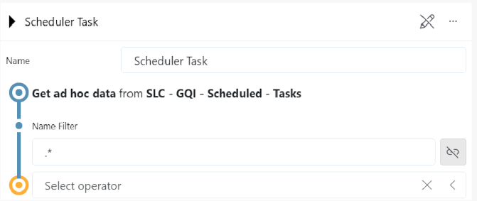
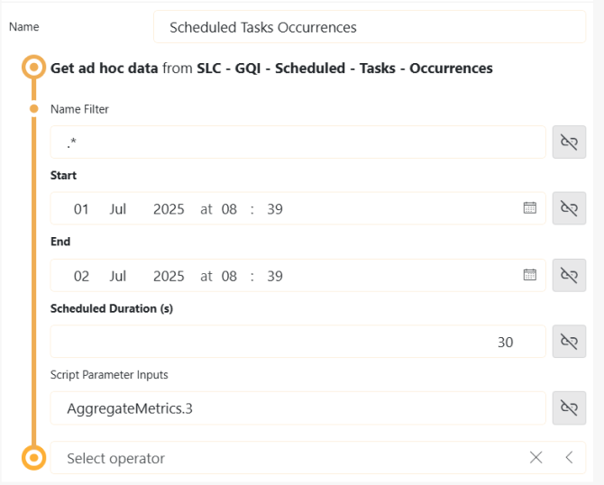

## About

This package consists of two ad hoc data sources, **SLC - GQI - Scheduled - Tasks** and **SLC - GQI - Scheduled - Tasks - Occurrences**, that retrieve information about scheduled tasks in a DataMiner System. By implementing these ad hoc data sources in low-code apps and/or dashboards, you can visualize data from the Scheduler module in a custom way.

**SLC - GQI - Scheduled - Tasks** provides a list of scheduled tasks from the DataMiner Scheduler module, while **SLC - GQI - Scheduled - Tasks - Occurrences** provides a list of the scheduled task occurrences based on the user's input in a specific period of time. This way, a customizable overview of tasks is provided.

## Key Features

The data sources offer a flexible framework for retrieving data about scheduled tasks by incorporating several features:

- **Regex filtering**: Users can specify a **regex** pattern to match task names, allowing for highly customizable filtering. This feature is particularly useful when managing large numbers of tasks, as it helps narrow down the data to only those tasks that meet specific naming criteria.
- **Time frame specification**: With the ability to define a **time frame**, users can control the period over which task occurrences are displayed.
- **Duration settings**: The option to set the **duration** of displayed tasks enhances timeline visualizations. 
- **Custom integration**: These features support seamless integration into custom dashboards and low-code apps, allowing users to create tailored visualizations that align with specific operational needs.
- **Input data overview**: Users can view the specified input data of scripts executed within the tasks.

## Use Cases 

The versatility of the package lends itself to a broad range of applications, including but not limited to:

- **Monitoring**: The ability to retrieve scheduled tasks across various DataMiner Agents makes it easier to monitor these. You can for instance use the data to set up dashboards that visualize task execution.
- **Troubleshooting and diagnostics**: When issues arise, the ability to drill down to specific task occurrences using time frames and regex filtering can help pinpoint the root cause of performance issues or scheduling conflicts.

## Configuration 

After the package has been deployed, two ad hoc data sources, **SLC - GQI - Scheduled - Tasks**  and  **SLC - GQI - Scheduled - Tasks - Occurrences**, will be available for use in GQI queries. For more information about GQI, refer to [Generic Query Interface](https://aka.dataminer.services/About_GQI).

### SLC - GQI - Scheduled - Tasks

While implementing **SLC - GQI - Scheduled - Tasks**, you can optionally specify the **Name Filter** input parameter. This regular expression (regex) pattern will be used to match the task name. If no name filter is specified, `.*` is used instead.

As a result, the GQI will retrieve the name, description, and type of the task, the ID of the Agent on which the task was executed, the result of the last run of the task, and the task's interval.

### SLC - GQI - Scheduled - Tasks - Occurrences

While implementing **SLC - GQI - Scheduled - Tasks - Occurrences**, you should specify the following input parameters:

- **Name Filter**: Optional. Regular expression (regex) to match the task name. If no name filter is specified, `.*` is used instead.
- **Start**: The beginning of the time frame during which task occurrences should be recorded.
- **End**: The end of the time frame during which task occurrences are recorded.
- **Scheduled Duration (s)**: The scheduled duration (in seconds) that will be displayed on the timeline, which does not necessarily match the actual duration.
- **Script Parameter Inputs**: Optional. Input values in the format `[ScriptName.InputParameterId]`. If nothing is specified for this parameter, no values are retrieved. Note that for tasks that do not include the specified script, an empty value will be returned.

As a result, the GQI will retrieve the start and end time, name, description, and type of the task as well as the ID of the Agent on which the task was executed. If specified, values of input parameters of specific executed scripts will be retrieved as well.

> [!NOTE]
> Only active scheduled tasks will be retrieved.

## Prerequisites

To use this package, make sure **DataMiner version 10.4.0-14003** or higher is installed.
